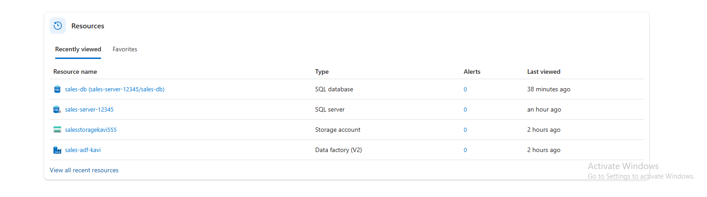
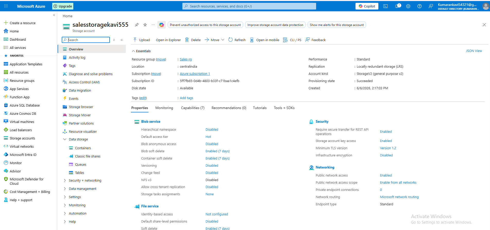
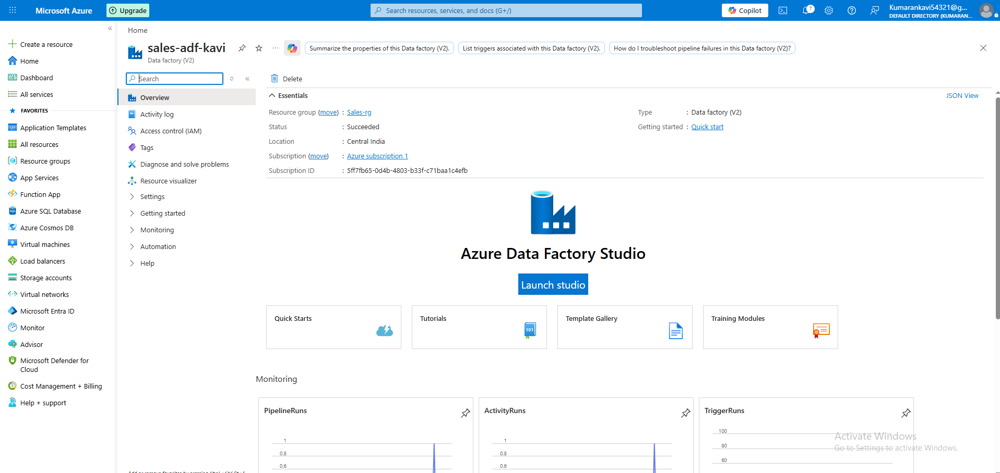
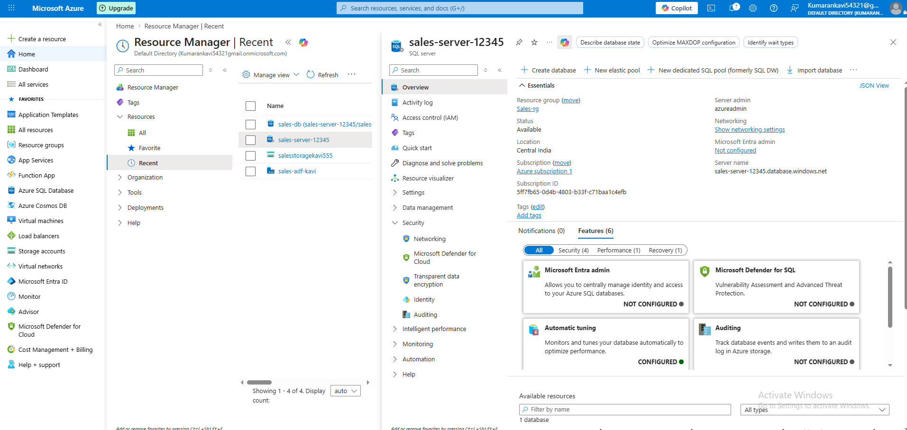
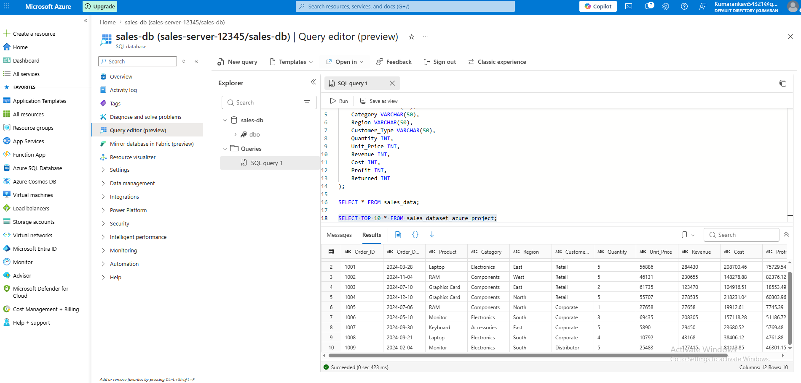

# Azure End-to-End Data Pipeline Project #
## Project Overview ##

This project demonstrates an end-to-end data pipeline built using Microsoft Azure services. The pipeline takes a CSV file as input, stores it in Azure Blob Storage, processes it using Azure Data Factory (ETL), and loads the data into Azure SQL Database for querying.

### Architecture Flow ###

CSV File → Azure Blob Storage → Azure Data Factory → Azure SQL Database

### Tools and Services Used ###
Azure Blob Storage (data storage)
Azure Data Factory (ETL pipeline)
Azure SQL Database (data warehouse)
SQL Server (managed service in Azure)
Project Steps
Created Azure Storage Account and Blob Container
Uploaded CSV file into Blob Storage
Created Azure SQL Server and Azure SQL Database
Created Azure Data Factory instance
Created Linked Services for:
Azure Blob Storage
Azure SQL Database
Built pipeline in Azure Data Factory
Copied data from Blob Storage to Azure SQL Database
Verified loaded data using SQL Query Editor
Screenshots
Azure Resources Created

Shows all resources used in this project.

### Azure Storage Account (Blob Storage) ###

CSV file uploaded into Blob container.

### Azure Data Factory Pipeline ###

ETL pipeline created using Copy Activity.

### SQL Server in Azure ###

SQL Server setup in Azure portal.

 
### Data Loaded in Azure SQL Database ###

Data successfully available in SQL Query Editor.

### Result ###

The pipeline successfully moves data from a CSV file in Azure Blob Storage to Azure SQL Database using Azure Data Factory.

This confirms:

Data ingestion works
ETL pipeline is functional
Data is successfully stored and queryable in SQL

### Conclusion ###

This project demonstrates a basic but complete Azure-based data engineering workflow covering storage, transformation, and loading of data using cloud services.
